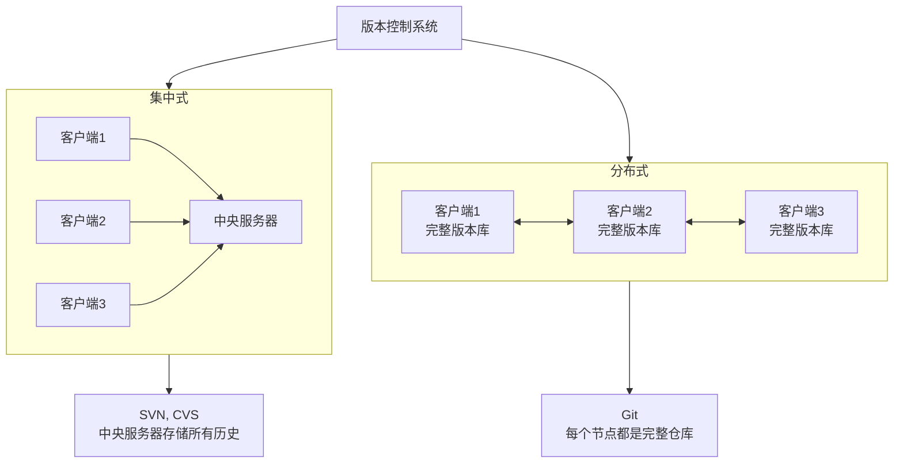
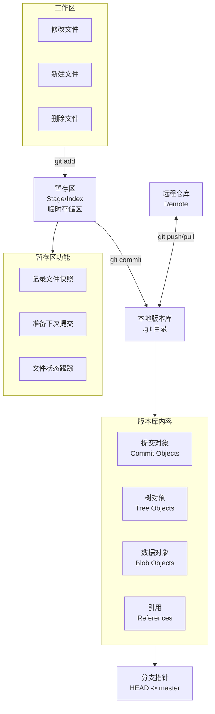
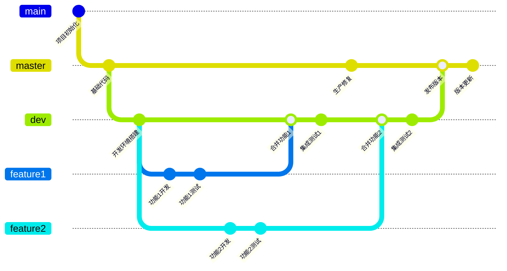
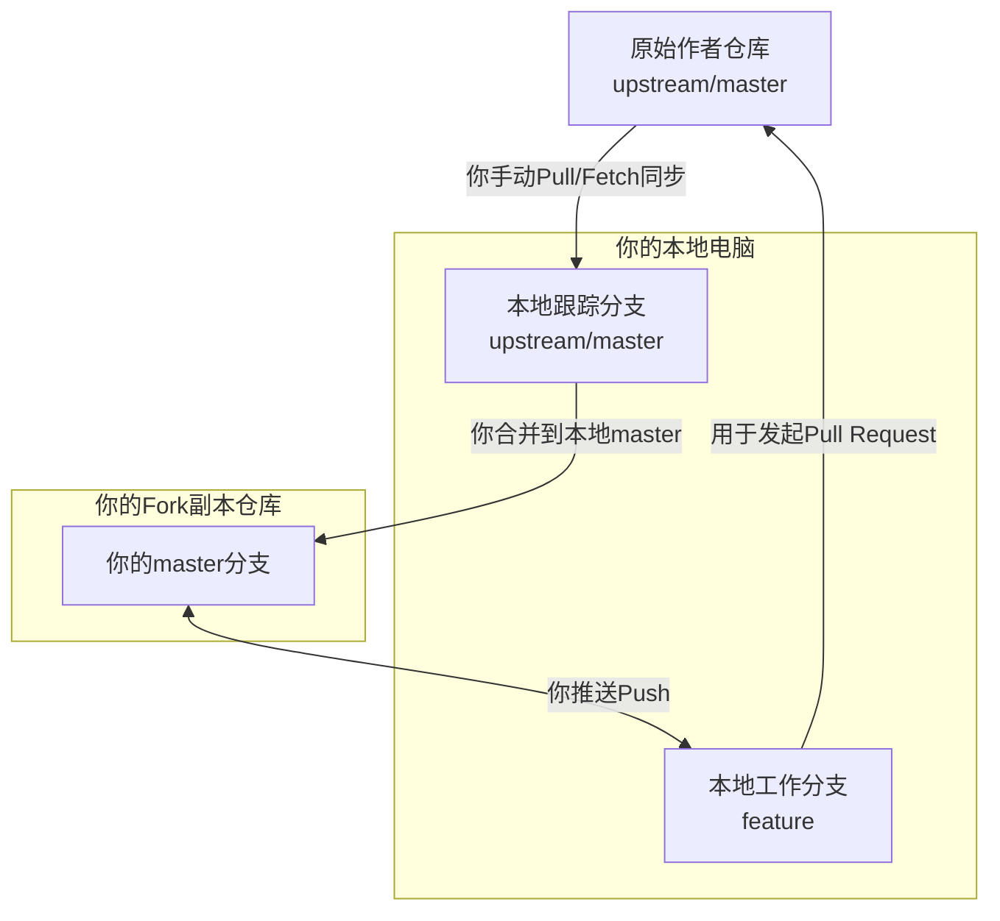

---
tags:
  - permanent
  - Git
---

## 参考
[git-scm](https://git-scm.cn/)
[Pro Git](https://git-scm.cn/book/en/v2)
[Git教程@廖雪峰](https://liaoxuefeng.com/books/git/introduction/index.html)
[[Git备忘录]]

## 版本控制系统
版本控制系统分为集中式和分布式。
集中式：由中央服务器控制。有SVN、CVS等。
分布式：每个人的电脑都具有完整的版本库。
Git管理的是修改不是文件。

## Git工作流

## 分支管理
分支就是指针
HEAD指针指向当前分支指针

## Fork-Pull Request 工作流

> [!warning]
> 不要将账号、密码等隐私信息提交、上传、推送到版本库

