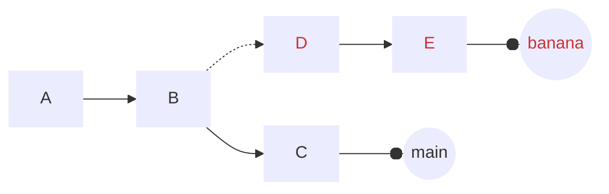
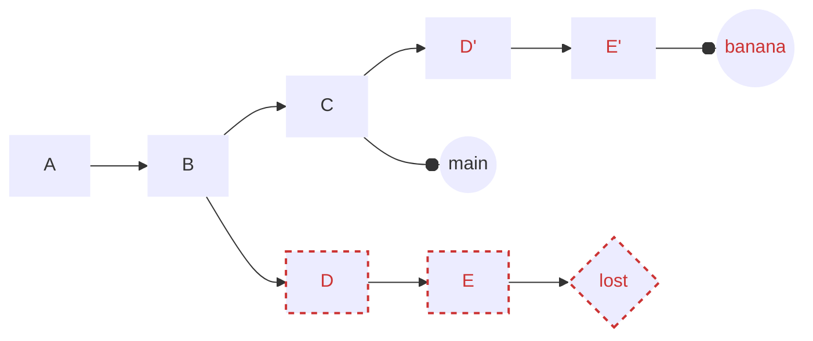
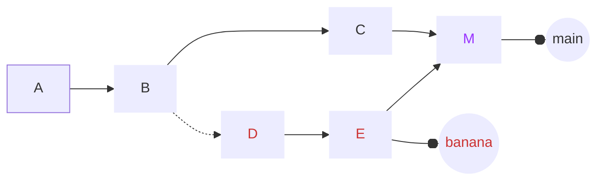
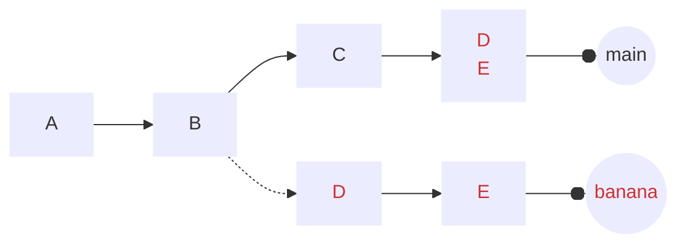
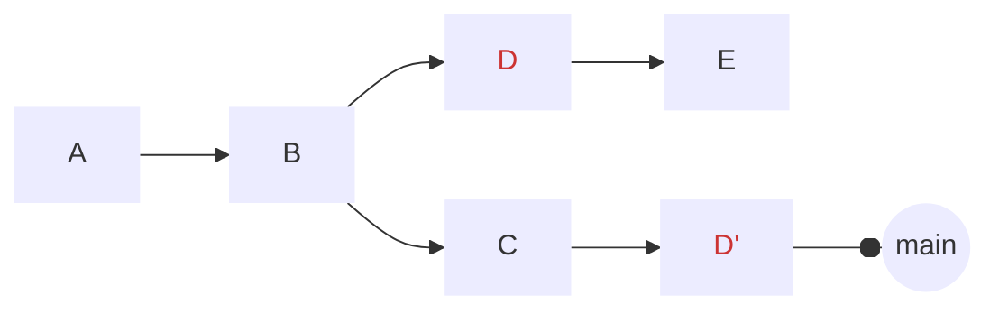
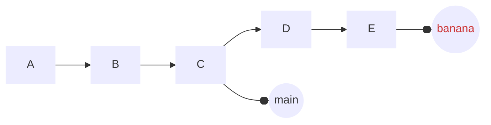
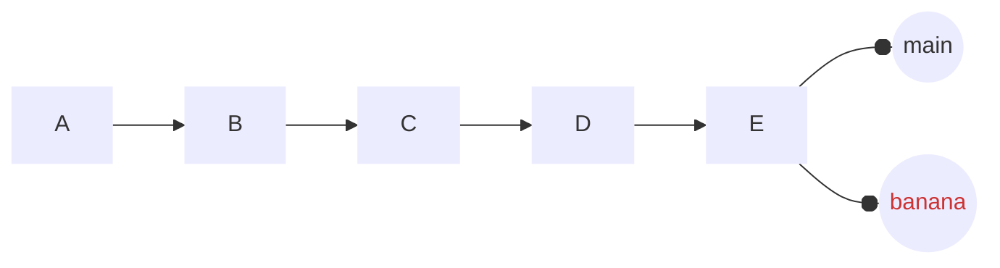

---
tags:
  - Git
---
## 参考
[[Git]]
[Git备忘录](https://git-scm.cn/cheat-sheet)

## 入门
### 初始化新仓库
`git init`
### 克隆现有仓库
`git clone <url>`
## 准备提交
### 添加未跟踪文件或未暂存的变更
`git add <文件>`
### 添加所有未跟踪文件和未暂存的变更
`git add .`
### 选择要暂存的文件部分
`git add -p`
### 移动文件
`git mv <旧名称> <新名称>`
### 删除文件
`git rm <文件>`
### 让 Git 忽略文件而不删除它
`git rm --cached <文件>`
### 让 Git 忽略目录而不删除它
`git rm --cached -r <目录>`
### 取消暂存一个文件
`git reset <文件>`
### 取消暂存所有内容
`git reset`
### 查看你已暂存的内容
`git status`
## 进行提交
### 进行提交（并打开文本编辑器编写提交信息）
`git commit`
### 进行提交
`git commit -m '提交信息'`
### 提交所有未暂存的变更
`git commit -am '提交信息'`
## 在分支间切换
### 切换分支
`git switch <分支名>`或`git checkout <分支名>`
### 创建分支
`git switch -c <分支名>`或`git checkout -b <分支名>`
### 列出分支
`git branch`
### 按最近提交时间列出分支
`git branch --sort=-committerdate`
### 删除分支
`git branch -d <分支名>`
### 强制删除分支
`git branch -D <分支名>`
## 查看暂存/未暂存的变更
### 查看所有暂存和未暂存的变更
`git diff HEAD`
### 只查看暂存的变更
`git diff --staged`
### 只查看未暂存的变更
`git diff`
## 查看提交记录的变更
### 显示一个提交与其父提交的差异
`git show <提交记录>`
### 比较两个提交记录的差异
`git diff <提交记录> <提交记录>`
### 比较一个文件自某个提交记录以来的差异
`git diff <提交记录> <文件>`
### 显示差异的摘要
`git diff <提交记录> --stat` `git show <提交记录> --stat`
## 引用提交记录的方式
每次我们说 `<提交记录>` 时，你都可以使用以下任何一种
一个分支 main
一个标签 v0.1
一个提交ID 3e887ab
一个远程分支 origin/main
当前提交 HEAD
3次提交前 HEAD^^^ 或 HEAD~3
## 放弃你的变更
### 放弃单个文件的未暂存变更
`git restore <文件>`或`git checkout <文件>`
### 放弃单个文件的所有暂存和未暂存变更
`git restore --staged --worktree <文件>`或`git checkout HEAD <文件>`
### 放弃所有暂存和未暂存的变更
`git reset --hard`
### 删除未跟踪文件
`git clean`
### '暂存' 所有暂存和未暂存的变更
`git stash`
## 编辑历史
### "撤销" 最近一次提交（保持工作目录不变）
`git reset HEAD^`
### 将最近 5 次提交合并成一次
`git rebase -i HEAD~6`
然后将要合并到前一个提交的提交记录前的 "pick" 改为 "fixup"
### 撤销一次失败的 rebase
`git reflog <分支名>`
然后手动在 reflog 中找到正确的提交 ID，再运行
`git reset --hard <提交记录>`
### 修改提交信息（或添加遗漏的文件）
`git commit --amend`
## 代码考古
### 查看分支的历史记录
`git log main` `git log --graph main` `git log --oneline`
### 显示修改了某个文件的所有提交记录
`git log <文件>`
### 显示修改了某个文件的所有提交记录，包括它重命名之前的记录
`git log --follow <文件>`
### 查找添加或删除了某些文本的所有提交记录
`git log -G banana`
### 显示最后修改了文件中某一行的人
`git blame <文件>`
## 合并分叉的分支
初始状态

### 使用 rebase 合并
`git switch banana` `git rebase main`

### 使用 merge 合并
`git switch main` `git merge banana`

### 使用 squash merge 合并
`git switch main` `git merge --squash banana` `git commit`

### 将一个提交记录复制到当前分支
`git cherry-pick <提交记录>`

### 将一个分支更新到与另一个分支同步（也称为 "快进合并"）
`git switch main` `git merge banana`
之前：

之后

## 恢复旧文件
### 获取另一个提交记录中某个文件的版本
`git checkout <提交记录> <文件>` 或 `git restore <文件> --source <提交记录>`
## 添加远程仓库
`git remote add <名称> <URL>`
## 推送你的变更
### 将 `main` 分支推送到远程 `origin`
`git push origin main`
### 将当前分支推送到其远程 "跟踪分支"
`git push`
### 推送一个你从未推送过的分支
`git push -u origin <分支名>`
### 强制推送
`git push --force-with-lease`
### 推送标签
`git push --tags`
## 拉取变更
### 获取变更（但不修改你任何本地分支）
`git fetch origin main`
### 获取变更然后 rebase 当前分支
`git pull --rebase`
### 获取变更然后将它们合并到当前分支
`git pull origin main` 或 `git pull`
## 配置 Git
### 设置一个配置选项
`git config user.name '你的名字'`
### 全局设置选项
`git config --global ...`
### 添加一个别名
`git config alias.st status`
### 查看所有可用的配置选项
`man git-config`
## 重要文件
### 本地 git 配置
`.git/config`
### 全局 git 配置
`~/.gitconfig`
### 要忽略的文件列表
`.gitignore`